.. _protocol-definitions-dsi:

Demand-Side Infrastructure
--------------------------

.. _protocol-definitions-dsp:

Demand-Side Platform
^^^^^^^^^^^^^^^^^^^^
An IT platform used by :ref:`Advertisers <protocol-definitions-advertiser>` to manage their :ref:`Campaigns <protocol-definitions-campaign>`. 
The demand-side module of an :ref:`AdServer <protocol-definitions-adserver>` is an example implementation of :ref:`Demand-Side Platform <protocol-definitions-dsp>`.

.. _protocol-definitions-dsa:

Demand-Side Agent
^^^^^^^^^^^^^^^^^
Executable code embedded by an :ref:`Advertiser <protocol-definitions-advertiser>` in a :ref:`Target <protocol-definitions-target>`. 
Each implementation of :ref:`Demand-Side Platform <protocol-definitions-dsp>` has its own implementation of :ref:`Demand-Side Agent <protocol-definitions-dsa>`. 
To be able to correctly redirect :ref:`User <protocol-definitions-user>`’s clicks, :ref:`Demand-Side Platform <protocol-definitions-dsp>` maintains a mapping 
between :ref:`Campaigns <protocol-definitions-campaign>` and their :ref:`Demand-Side Agents <protocol-definitions-dsa>`.

.. _protocol-definitions-apm:

Ad Pay Module
^^^^^^^^^^^^^
A module integrated with an instance of :ref:`Demand-Side Platform <protocol-definitions-dsp>`, or operating as an external service for
:ref:`Demand-Side Platform <protocol-definitions-dsp>`, containing business logic whose role is to manage the :ref:`Advertiser <protocol-definitions-advertiser>`'s 
finances, while optimizing the :ref:`Advertiser <protocol-definitions-advertiser>`'s cost.

.. note::
    :ref:`Demand-Side Platform <protocol-definitions-dsp>` and :ref:`Demand-Side Agent <protocol-definitions-dsa>` are free to communicate in any way they choose, 
    as this communication is *not* part of :ref:`Adshares Protocol<adshares-protocol>`. Whereas the communication between 
    :ref:`Demand-Side Platform <protocol-definitions-dsp>` and :ref:`Ad Pay Module <protocol-definitions-apm>` is included in :ref:`Adshares Protocol<adshares-protocol>`.