.. _adshares-protocol:

Adshares Protocol
==================
:ref:`Adshares Protocol <adshares-protocol>` describes interactions between the following pieces of infrastructure within the :ref:`Adshares Ecosystem <protocol-definitions-ecosystem>`:

* :ref:`Supply-Side Infrastructure <protocol-definitions-ssi>`
* :ref:`Demand-Side Infrastructure <protocol-definitions-dsi>`
* :ref:`Context Infrastructure <protocol-definitions-contextinfrastructure>`
* :ref:`Tagging Infrastructure <protocol-definitions-tagginginfrastructure>`

The following diagram illustrates the components making up the above infrastructure and the relationships between them:

.. Check out the :doc:`Definitions <definitions/index>` section.

The following diagram illustrates an overview of all the different workflows occuring within the infrastructure:

.. uml::
    :align: center

    skinparam monochrome true

    participant "Supply-Side\nAgent"        as SSA
    participant "Supply-Side\nPlatform"     as SSP
    participant "ADS Blockchain"            as blockchain
    participant "Demand-Side\nPlatform"     as DSP
    participant "Demand-Side\nAgent"        as DSA
    
    ==Synchronization==

    DSP -> blockchain: Broadcast
    SSP -> blockchain: Fetch broadcasts
    blockchain --> SSP: List of broadcasts
    SSP -> DSP : Fetch Inventory
    DSP --> SSP: Inventory
    SSP -> SSP: Update Inventory

    ==Impressions==

    SSA -> SSP : Register Event

    SSA -> SSP : Find Creatives
    SSP --> SSA : Return Creatives

    SSA -> DSP : Get Creative Content
    DSP --> SSA : Return Creative Content

    SSA -> SSP: View Event
    SSP -> DSP: View Event\n//redirected//
    SSA -> DSP : Register Event

    SSA -> SSP : Click Event
    SSP -> DSP : Click Event\n//redirected//
    DSP -> DSA : Click Event\n//redirected//

    ==Payments==

    DSP -> blockchain: Send\nmulti-transaction
    SSP -> blockchain: Fetch transactions
    blockchain --> SSP: List of transactions
    SSP -> DSP: Fetch\nPayment Report
    DSP --> SSP: Return\nPayment Report

The following areas are handled by :ref:`Adshares Protocol <adshares-protocol>`:

:doc:`Authentication <authentication/index>`
--------------------------------------------
How various entities participating in :ref:`Adshares Protocol <adshares-protocol>` authenticate each other.

:doc:`Synchronization <synchronization/index>`
----------------------------------------------
#. How :ref:`Supply-Side Infrastructure <protocol-definitions-ssi>` and :ref:`Demand-Side Infrastructure <protocol-definitions-dsi>` announce their current availability:
    * published by: :ref:`Supply-Side Platform <protocol-definitions-ssp>` and :ref:`Demand-Side Platform <protocol-definitions-dsp>`
    * retrieved by: :ref:`Supply-Side Platform <protocol-definitions-ssp>` and :ref:`Demand-Side Platform <protocol-definitions-dsp>`
    * medium: :ref:`ADS Blockchain <protocol-definitions-blockchain>`

#. How :ref:`Demand-Side Infrastructure <protocol-definitions-dsi>` exposes its inventory data:
    * exposed by: :ref:`Demand-Side Platform <protocol-definitions-dsp>`
    * consumed by: :ref:`Supply-Side Platform <protocol-definitions-ssp>`
    * returns: :ref:`Demand-Side Inventory <protocol-definitions-demandinventory>`

#. How :ref:`Supply-Side Infrastructure <protocol-definitions-ssi>` exposes its inventory data:
    * exposed by: :ref:`Supply-Side Platform <protocol-definitions-ssp>`
    * consumed by: :ref:`Demand-Side Platform <protocol-definitions-dsp>`
    * returns: :ref:`Supply-Side Inventory <protocol-definitions-supplyinventory>`

:doc:`Impressions <impressions/index>`
--------------------------------------
#. How :ref:`Context Infrastructure <protocol-definitions-contextinfrastructure>` exposes context data:
    * exposed by: :ref:`Context Platform <protocol-definitions-cp>`
    * consumed by: :ref:`Supply-Side Platform <protocol-definitions-ssp>` and :ref:`Demand-Side Platform <protocol-definitions-dsp>`
    * returns: :ref:`Context Data <protocol-definitions-contextdata>`

#. How :ref:`Context Infrastructure <protocol-definitions-contextinfrastructure>` accepts notifications about :ref:`Register Events <protocol-definitions-registerevent>`:
    * exposed by: :ref:`Context Platform <protocol-definitions-cp>`
    * consumed by: :ref:`Supply-Side Agent <protocol-definitions-ssa>`
    * returns: :ref:`Context Script <protocol-definitions-contextscript>`

#. How :ref:`Demand-Side Infrastructure <protocol-definitions-dsi>` exposes content data:
    * exposed by: :ref:`Demand-Side Platform <protocol-definitions-dsp>`
    * consumed by: :ref:`Supply-Side Agent <protocol-definitions-ssa>`
    * returns: :ref:`Creative Content <protocol-definitions-creativecontent>`

#. How :ref:`Demand-Side Infrastructure <protocol-definitions-dsi>` accepts notifications about :ref:`View Events <protocol-definitions-viewevent>`:
    * exposed by: :ref:`Demand-Side Platform <protocol-definitions-dsp>`
    * consumed by: :ref:`Supply-Side Agent <protocol-definitions-ssa>`
    * returns: an endpoint for :ref:`Register Event <protocol-definitions-registerevent>` notifications

:doc:`Payments <payments/index>`
--------------------------------
#. How :ref:`Demand-Side Infrastructure <protocol-definitions-dsi>` sends payments to :ref:`Supply-Side Infrastructure <protocol-definitions-ssi>`:
    * payer: :ref:`Demand-Side Platform <protocol-definitions-dsp>`
    * payee: :ref:`Supply-Side Platform <protocol-definitions-ssp>`
    * medium: :ref:`ADS Blockchain <protocol-definitions-blockchain>`

#. How :ref:`Demand-Side Infrastructure <protocol-definitions-dsi>` exposes payment reports:
    * exposed by: :ref:`Demand-Side Platform <protocol-definitions-dsp>`
    * consumed by: :ref:`Supply-Side Platform <protocol-definitions-ssp>`
    * returns: :ref:`Payment Report <protocol-definitions-paymentreport>`

Contents
^^^^^^^^
.. toctree::
    :maxdepth: 1
    
    definitions/index
    taxonomy/index
    authentication/index
    synchronization/index
    impressions/index
    payments/index
