.. _protocol-contextinfrastructure:

Context Infrastructure
----------------------

Both :ref:`Supply-Side Platforms <protocol-definitions-ssp>` and :ref:`Demand-Side Platforms <protocol-definitions-dsp>`
use :ref:`Context Platform <protocol-definitions-cp>` to retrieve data about :ref:`Users <protocol-definitions-user>`,
:ref:`Sites <protocol-definitions-site>` and :ref:`Devices <protocol-definitions-device>`.

:ref:`Supply-Side Platform <protocol-definitions-ssp>` and :ref:`Demand-Side Platform <protocol-definitions-dsp>` need to independently decide 
which instances of :ref:`Context Platform <protocol-definitions-cp>` they trust and then independently query them. 

Even if :ref:`Supply-Side Platform <protocol-definitions-ssp>` and :ref:`Demand-Side Platform <protocol-definitions-dsp>` end up trusting 
the same instance of :ref:`Context Platform <protocol-definitions-cp>`, they need to query it separately.
