.. _protocol-dsi:

Demand-Side Infrastructure
--------------------------

:ref:`Demand-Side Infrastructure <protocol-dsi>` delivers services for :ref:`Advertisers <protocol-definitions-advertiser>`, or acts on their behalf.
The central part of :ref:`Demand-Side Infrastructure <protocol-dsi>` consists of :ref:`Demand-Side Platform <protocol-definitions-dsp>`.

:ref:`Demand-Side Platform <protocol-definitions-dsp>` and :ref:`Demand-Side Agent <protocol-definitions-dsa>` are free to communicate in any way they choose, 
as this communication is *not* part of :ref:`Adshares Protocol <adshares-protocol>`.

Whereas the communication between :ref:`Demand-Side Platform <protocol-definitions-dsp>` and :ref:`Ad Pay Module <protocol-definitions-apm>`
might be part of :ref:`Adshares Protocol <adshares-protocol>` in case :ref:`Ad Pay Module <protocol-definitions-apm>` is delivered by a third-party vendor.

:ref:`Adshares Protocol <adshares-protocol>` defines the following interactions between :ref:`Demand-Side Platform <protocol-definitions-dsp>`  
and other entities within the :ref:`Adshares Ecosystem <protocol-definitions-ecosystem>`:

* :ref:`Demand-Side Platform <protocol-definitions-dsp>` calls :ref:`Creative Tagging Platform <protocol-definitions-ctp>` to tag the :ref:`Creatives <protocol-definitions-creative>`
  that remain under its control.
* :ref:`Demand-Side Platform <protocol-definitions-dsp>` calls :ref:`Site Tagging Platform <protocol-definitions-stp>` to verify tags assigned 
  to :ref:`Sites <protocol-definitions-site>` by :ref:`Supply-Side Platform <protocol-definitions-ssp>`.
* :ref:`Demand-Side Platform <protocol-definitions-dsp>` calls :ref:`Context Platform <protocol-definitions-cp>` to retrieve 
  :ref:`Context Data <protocol-definitions-contextdata>` regarding :ref:`Users <protocol-definitions-user>`, :ref:`Sites <protocol-definitions-site>`
  and :ref:`Devices <protocol-definitions-device>`.
* :ref:`Demand-Side Platform <protocol-definitions-dsp>` receives :ref:`Impression Events <protocol-definitions-impression>` redirected to it 
  by :ref:`Supply-Side Platform <protocol-definitions-ssp>`.
* :ref:`Demand-Side Platform <protocol-definitions-dsp>` responds to requests from :ref:`Supply-Side Platforms <protocol-definitions-ssp>` 
  regarding :ref:`Payment Reports <protocol-definitions-paymentreport>`.

The following interactions are optionally included in :ref:`Adshares Protocol <adshares-protocol>`:

* :ref:`Demand-Side Platform <protocol-definitions-dsp>` interacts with its :ref:`Ad Pay Module <protocol-definitions-apm>` to generate
  :ref:`Payment Reports <protocol-definitions-paymentreport>`.

The following interactions are outside of :ref:`Adshares Protocol <adshares-protocol>`:

* :ref:`Demand-Side Platform <protocol-definitions-dsp>` interacts with its :ref:`Demand-Side Agent <protocol-definitions-dsa>` to receive notifications
  about :ref:`Conversion Events <protocol-definitions-conversion>`.
