.. _protocol-ssi:

Supply-Side Infrastructure
--------------------------

:ref:`Supply-Side Infrastructure <protocol-ssi>` delivers services for :ref:`Publishers <protocol-definitions-publisher>`, or acts on their behalf.
The central part of :ref:`Supply-Side Infrastructure <protocol-ssi>` consists of :ref:`Supply-Side Platform <protocol-definitions-ssp>`.

:ref:`Supply-Side Platform <protocol-definitions-ssp>` and :ref:`Supply-Side Agent <protocol-definitions-ssa>` are free to communicate in any way they choose, 
as this communication is *not* part of :ref:`Adshares Protocol<adshares-protocol>`. Whereas the communication between :ref:`Supply-Side Platform <protocol-definitions-ssp>` 
and :ref:`Ad Select Module <protocol-definitions-asm>` is included in :ref:`Adshares Protocol<adshares-protocol>`.

:ref:`Adshares Protocol <adshares-protocol>` defines the following interactions between :ref:`Supply-Side Platform <protocol-definitions-ssp>`  
and other entities within the :ref:`Adshares Ecosystem <protocol-definitions-ecosystem>`:

* :ref:`Supply-Side Platform <protocol-definitions-ssp>` calls :ref:`Site Tagging Platform <protocol-definitions-stp>` to tag the :ref:`Sites <protocol-definitions-site>` 
  that remain under its control.
* :ref:`Supply-Side Platform <protocol-definitions-ssp>` calls :ref:`Creative Tagging Platform <protocol-definitions-ctp>` to verify tags assigned 
  to :ref:`Creatives <protocol-definitions-creative>` by :ref:`Demand-Side Platform <protocol-definitions-dsp>`.
* :ref:`Supply-Side Platform <protocol-definitions-ssp>` calls :ref:`Context Platform <protocol-definitions-cp>` to retrieve 
  :ref:`Context Data <protocol-definitions-contextdata>` regarding :ref:`Users <protocol-definitions-user>`, :ref:`Sites <protocol-definitions-site>`
  and :ref:`Devices <protocol-definitions-device>`.
* :ref:`Supply-Side Platform <protocol-definitions-ssp>` redirects :ref:`Impression Events <protocol-definitions-impression>` 
  to :ref:`Demand-Side Platforms <protocol-definitions-dsp>`.
* :ref:`Supply-Side Platform <protocol-definitions-ssp>` calls :ref:`Demand-Side Platform <protocol-definitions-dsp>` 
  to retrieve :ref:`Payment Reports <protocol-definitions-paymentreport>`.

The following interactions remain outside of :ref:`Adshares Protocol <adshares-protocol>`:

* :ref:`Supply-Side Platform <protocol-definitions-ssp>` interacts with its :ref:`Ad Select Module <protocol-definitions-asm>` to generate a list 
  of :ref:`Creatives <protocol-definitions-creative>` requested by its :ref:`Supply-Side Agent <protocol-definitions-ssa>`.
* :ref:`Supply-Side Platform <protocol-definitions-ssp>` interacts with its :ref:`Supply-Side Agent <protocol-definitions-ssa>` to receive notifications
  about :ref:`Impression Events <protocol-definitions-impression>`.
