.. _protocol-tagginginfrastructure:

Tagging Infrastructure
----------------------

:ref:`Supply-Side Platform <protocol-definitions-ssp>` uses :ref:`Site Tagging Provider <protocol-definitions-stp>` to tag the :ref:`Sites <protocol-definitions-site>` 
that remain under its control. Similarly, :ref:`Demand-Side Platform <protocol-definitions-dsp>` uses :ref:`Creative Tagging Provider <protocol-definitions-ctp>`
to tag the :ref:`Creatives <protocol-definitions-creative>` that remain under its control.

Here is the business justification for tagging:

* Tagging is needed by :ref:`Supply-Side Platform <protocol-definitions-ssp>` to be able to properly define its :ref:`Supply-Side Inventory <protocol-synchronization-supplyinventory>`.
  It's up to :ref:`Supply-Side Platform <protocol-definitions-ssp>` to choose the appropriate :ref:`Site Tagging Provider <protocol-definitions-stp>` service, 
  but this choice should be acceptable for all :ref:`Demand-Side Platforms <protocol-definitions-dsp>` a given :ref:`Supply-Side Platform <protocol-definitions-ssp>` intends to cooperate with.
* Similarly, tagging is needed by :ref:`Demand-Side Platform <protocol-definitions-dsp>` to be able to properly define its :ref:`Demand-Side Inventory <protocol-synchronization-demandinventory>`.
  It's up to :ref:`Demand-Side Platform <protocol-definitions-dsp>` to choose the appropriate :ref:`Creative Tagging Provider <protocol-definitions-ctp>` service, 
  but this choice should be acceptable for all :ref:`Supply-Side Platforms <protocol-definitions-ssp>` a given :ref:`Demand-Side Platform <protocol-definitions-dsp>` intends to cooperate with.

When queried, both :ref:`Site Tagging Provider <protocol-definitions-stp>` and :ref:`Creative Tagging Provider <protocol-definitions-ctp>` 
should sign their responses with private keys, so that the tags assigned to :ref:`Sites <protocol-definitions-site>` 
or :ref:`Creatives <protocol-definitions-creative>` remain cryptographically verifiable. This way there is no need to invoke the same query multiple times, 
as long as :ref:`Supply-Side Platform <protocol-definitions-ssp>` trusts :ref:`Creative Tagging Provider <protocol-definitions-ctp>` service 
chosen by :ref:`Demand-Side Platform <protocol-definitions-dsp>`, or :ref:`Demand-Side Platform <protocol-definitions-dsp>` trusts 
:ref:`Site Tagging Provider <protocol-definitions-stp>` service chosen by :ref:`Supply-Side Platform <protocol-definitions-ssp>`.
