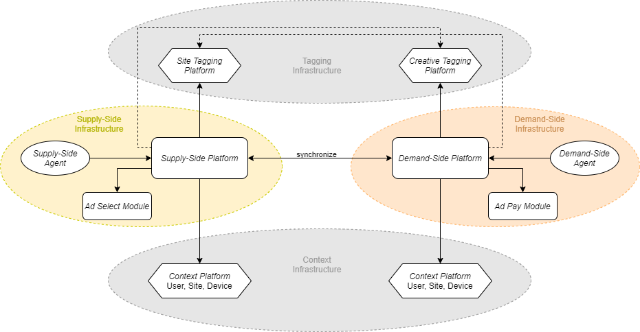

.. _adshares-protocol2:

Adshares Protocol2
==================
*Adshares Protocol* describes interactions between the following entities within the Adshares ecosystem:

- Supply-Side Infrastructure
- Demand-Side Infrastructure
- Context Infrastructure
- Tagging Infrastructure

Check out the :doc:`Lorem Ipsum <foo/index>` section for further information, including how to
:ref:`foo bar <protocol-definitions-viewevent>` the project.

Contents
^^^^^^^^
.. toctree::
    :maxdepth: 1
    
    definitions/index
    scope/index
    synchronization/index
    impressions/index
    payments/index
    foo/index
